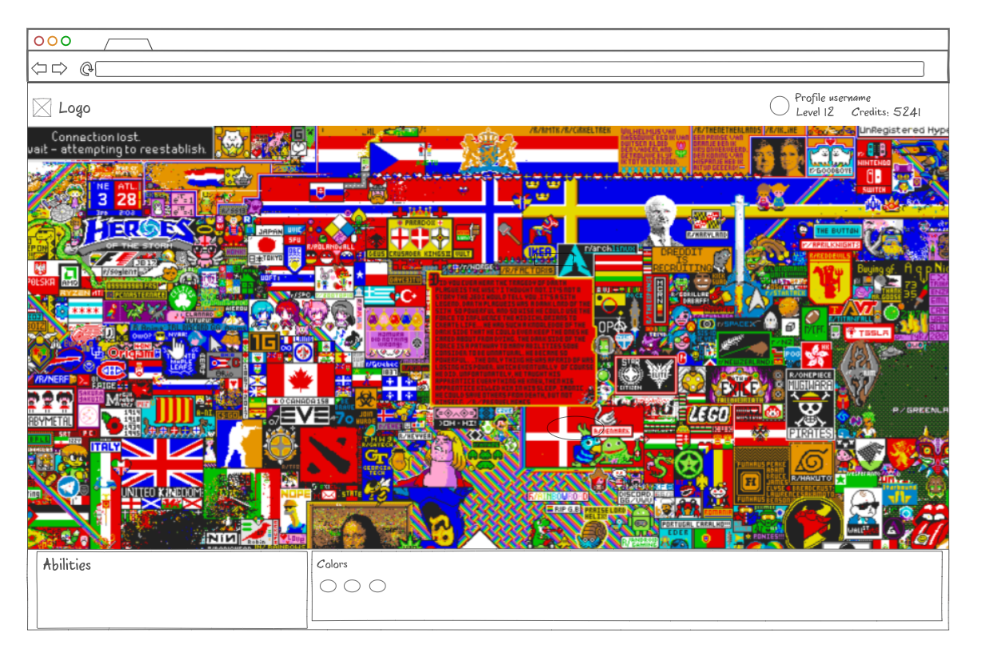
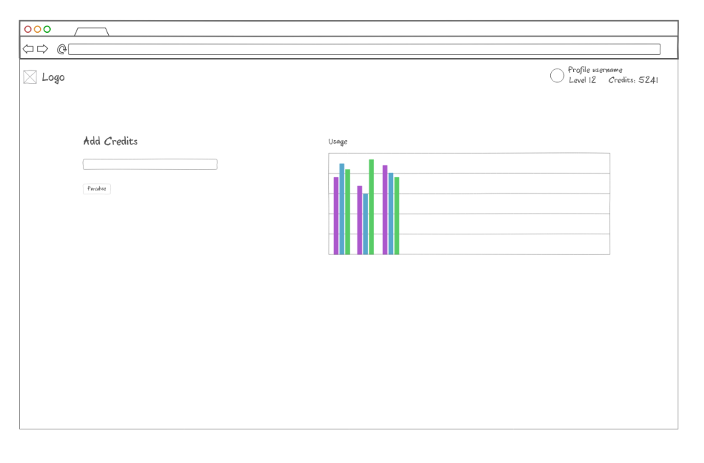

# r/Place with video game progression

This project will be a replica of r/place with a twist. In this version, users will engage in an RPG-like experience, starting with 500 pixels. As they place pixels on the canvas, they gain experience points. The twist? Users can level up, unlock special abilities, and engage in pixel battles. It's a blend of collaborative art creation and individual progression.

## Key features and technology representation

- A login and registration system with tokens to identify if a request to the API is valid and who made the request.
- API for pixel placing. Users will have api access via their tokens, so creation of bots on their end is possible.
- An interactive, realtime map for viewing/placing pixels.

Each point addresses authentication, database data, and websocket data respectively

## Possible additions

- A realtime chat service
- Abilitiy to buy credits
- Daily quests to recieve free credits, or experience

## Mock picture

## Learned stuff

- `<nav>` goes in `<header>`
- Then `<main></main>`
- Then `<footer></footer>`
